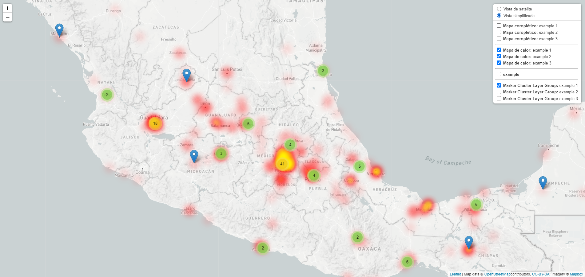
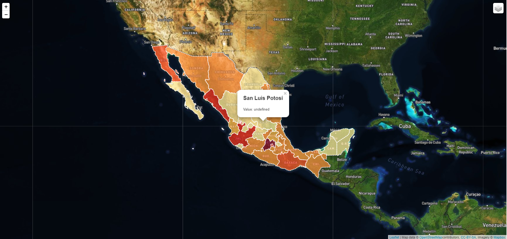

# Leaflet Tests

> Building knowledge of Leaflet through exploring multiple functionalities and plugins.

Interactive map that allows you to geographically visualize data and analyze risk. This project include a Layer Control with Choroplet maps, Heatmaps, marker clustering and many other features.

## Built With

- Leaflet.js
- Marker Cluster Layer Control
- Heatmaps
- Choroplet maps

## How to

- To access its features, just click on the upper right corner to start exploring this amazing library.

## Features

- Choroplet maps are a simple way to visualize how a measure varies in a geographic area or to show the level of variability of that measure within a region. By clicking on each region, you can see the number of incidents for each state.
- Heat maps show the magnitude of a phenomenon as a color in two dimensions.
- It is a responsive map, which means that it is accessible to phones. You can access the map from almost anywhere.
- You can choose between two different base layers, light (default) and satellite, which allows you to observe the panorama at street level.

## Limitations

- Call the heatmap in small zoom because when you zoom in you cannot change the layer or deactivate it.
- The choroplane map does not sum individual layers yet.

## Live Demo

Live demo [here!](https://rawcdn.githack.com/angel-mora/Leaflet-tests/f0d147fbcbb1443bc638d9b6afba60482cbb6c84/index.html)

## Useful Links

- https://leafletjs.com/examples.html
- http://geojson.io/
- https://github.com/Leaflet/Leaflet.markercluster
- https://github.com/ghybs/Leaflet.MarkerCluster.LayerSupport
- https://github.com/ghybs/Leaflet.MarkerCluster.Freezable

## Authors

👤 **Angel Mora**

- Github: [@angel-mora](https://github.com/angel-mora)
- Linkedin: [Angel Mora](https://www.linkedin.com/in/angelmoram/)

## 🤝 Contributing

Pull requests, contributions, issues and other feature requests are welcome!

Feel free to check the [issues page](issues/).

## Show your support

Give a ⭐️ if you like this project!

## Acknowledgments

- Manuel Durazo
- Jorge Fernando
- Diego Valle
- Microverse
- ¡Viva México! 🇲🇽

## 📝 License

This project is [MIT](lic.url) licensed.
